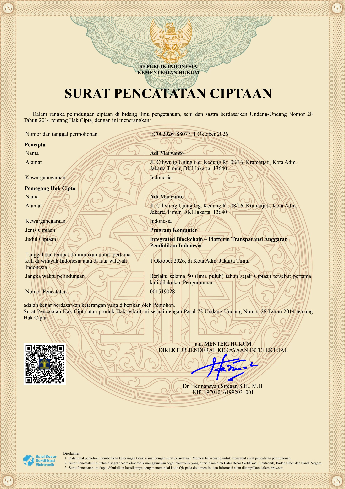

# 🏛️ Surat Pencatatan Ciptaan (Hak Kekayaan Intelektual - HKI)
### Kementerian Hukum Republik Indonesia — Direktorat Jenderal Kekayaan Intelektual (DJKI)

Dokumen ini merupakan bukti pencatatan resmi **Hak Kekayaan Intelektual (Hak Cipta)** atas karya cipta Program Komputer **Integrated Blockchain – Platform Transparansi Anggaran Pendidikan Indonesia** yang diterbitkan oleh Kementerian Hukum Republik Indonesia berdasarkan **Undang-Undang Nomor 28 Tahun 2014 tentang Hak Cipta**.

---

## 📜 Salinan Sertifikat Resmi

  
  

    <em>Klik gambar untuk mengunduh dokumen resmi format PDF asli berpenandatangan digital DJKI.</em>
  

### 📥 Unduh Dokumen Resmi:
- 📄 **[Unduh Surat Pencatatan Ciptaan Asli (Format PDF)](docs/hki/Surat-Pencatatan-Hak-Cipta-EC002026188077.pdf)** *(1.69 MB, dilengkapi segel digital BSrE)*
- 🖼️ **[Lihat Gambar Resolusi Tinggi (Format PNG)](docs/hki/Surat-Pencatatan-Hak-Cipta-EC002026188077.png)** *(4.45 MB)*

---

## 📋 Data Resmi Surat Pencatatan Ciptaan

Berdasarkan surat resmi Kementerian Hukum Republik Indonesia Nomor **001519028**:

| Parameter Ciptaan | Keterangan Resmi DJKI |
|---|---|
| **Nomor Permohonan** | **`EC002026188077`** |
| **Tanggal Permohonan** | **1 Oktober 2026** |
| **Nomor Pencatatan** | **`001519028`** |
| **Pencipta** | **Adi Maryanto** |
| **Alamat Pencipta** | Jl. Ciliwung Ujung Gg. Kedung Rt. 08/16, Kramatjati, Kota Adm. Jakarta Timur, DKI Jakarta, 13640 |
| **Kewarganegaraan** | Indonesia |
| **Pemegang Hak Cipta** | **Adi Maryanto** |
| **Alamat Pemegang Hak Cipta** | Jl. Ciliwung Ujung Gg. Kedung Rt. 08/16, Kramatjati, Kota Adm. Jakarta Timur, DKI Jakarta, 13640 |
| **Jenis Ciptaan** | **Program Komputer** |
| **Judul Ciptaan** | **Integrated Blockchain – Platform Transparansi Anggaran Pendidikan Indonesia** |
| **Tanggal Diumumkan Pertama Kali** | **1 Oktober 2026**, di Kota Adm. Jakarta Timur |
| **Jangka Waktu Perlindungan** | **Berlaku selama 50 (lima puluh) tahun** sejak Ciptaan tersebut pertama kali dilakukan Pengumuman |
| **Dasar Hukum Perlindungan** | **Pasal 72 Undang-Undang Nomor 28 Tahun 2014 tentang Hak Cipta** |
| **Pejabat Penandatangan** | a.n. MENTERI HUKUM DIREKTUR JENDERAL KEKAYAAN INTELEKTUAL **Dr. Hermansyah Siregar, S.H., M.H.** NIP. 197010161992031001 |
| **Otoritas Sertifikasi Elektronik** | **Balai Besar Sertifikasi Elektronik (BSrE)**, Badan Siber dan Sandi Negara (BSSN) |

---

## 🛡️ Verifikasi Keaslian Dokumen

Surat Pencatatan Ciptaan ini telah disegel secara elektronik menggunakan sertifikat digital resmi yang diterbitkan oleh Balai Besar Sertifikasi Elektronik (BSrE), Badan Siber dan Sandi Negara (BSSN).

Keaslian dokumen ini dapat dibuktikan secara langsung oleh publik melalui:
1. **Memindai (Scan) QR Code** yang tercetak pada sertifikat menggunakan kamera smartphone atau barcode scanner.
2. Browser akan secara otomatis mengarahkan ke basis data resmi pelindungan ciptaan DJKI Kemenkumham Republik Indonesia.

---

## ⚖️ Implikasi Hukum & Perlindungan Hak Kekayaan Intelektual

Karya cipta program komputer ini dilindungi secara hukum berdasarkan **Undang-Undang Nomor 28 Tahun 2014 tentang Hak Cipta**:

1. **Hak Eksklusif Pemegang Hak Cipta**:
   - Pemegang Hak Cipta (`Adi Maryanto`) memiliki hak moral dan hak ekonomi penuh untuk menerbitkan, memperbanyak, menerjemahkan, mengadaptasi, mendistribusikan, dan mengkomersialisasikan karya cipta ini.
2. **Larangan Penggunaan Tanpa Izin**:
   - Berdasarkan kebijakan repositori pada berkas **[LICENSE](LICENSE)**, lisensi yang berlaku adalah **Restricted Private Use License**.
   - Penggunaan hanya diizinkan untuk **Private use** (pribadi, peninjauan kode, evaluasi non-komersial).
   - Segala bentuk penyalinan, pembajakan, distribusi ulang, komersialisasi, modifikasi publik, atau pengakuan sepihak atas ciptaan ini tanpa persetujuan tertulis resmi dari Pemegang Hak Cipta merupakan perbuatan melawan hukum.
3. **Ketentuan Pidana Pelanggaran Hak Cipta**:
   - Pelanggaran terhadap hak cipta program komputer dapat dikenakan sanksi pidana berdasarkan **Pasal 113 Undang-Undang Hak Cipta No. 28 Tahun 2014**, dengan ancaman pidana penjara paling lama **10 (sepuluh) tahun** dan/atau pidana denda paling banyak **Rp 4.000.000.000,00 (empat miliar rupiah)**.

---

## 🔗 Keterhubungan dengan Dokumen Repositori

- **Lisensi Repositori**: [LICENSE](LICENSE) *(Restricted Private Use License)*
- **Pengakuan Pustaka Open-Source Pihak Ketiga**: [THIRD_PARTY_NOTICES.md](THIRD_PARTY_NOTICES.md) *(Atribusi 52 dependensi pihak ketiga)*
- **Spesifikasi Kebutuhan Produk (PRD)**: [PRD.md](PRD.md)
- **Topologi Sistem & Arsitektur**: [TOPOLOGY.md](TOPOLOGY.md)
