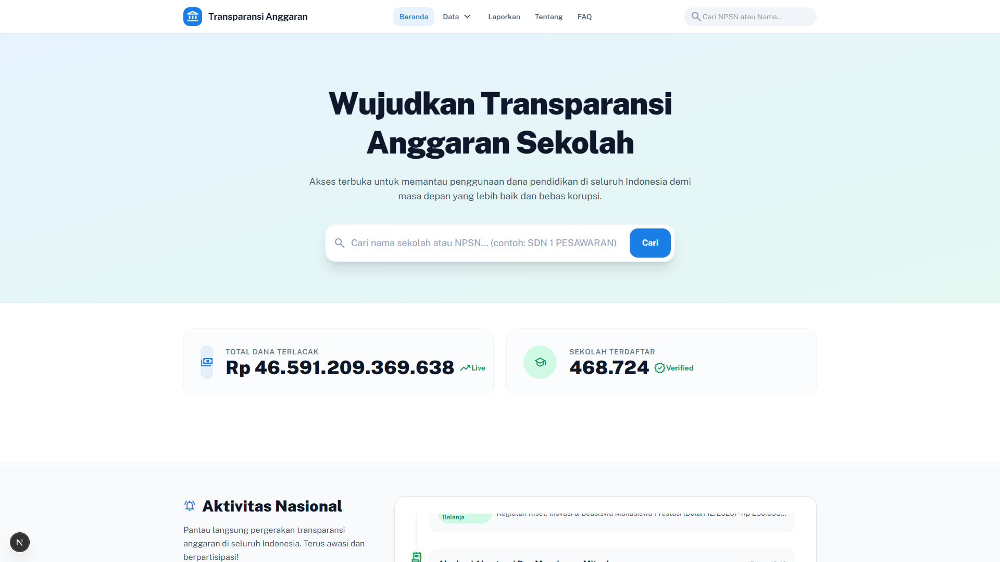
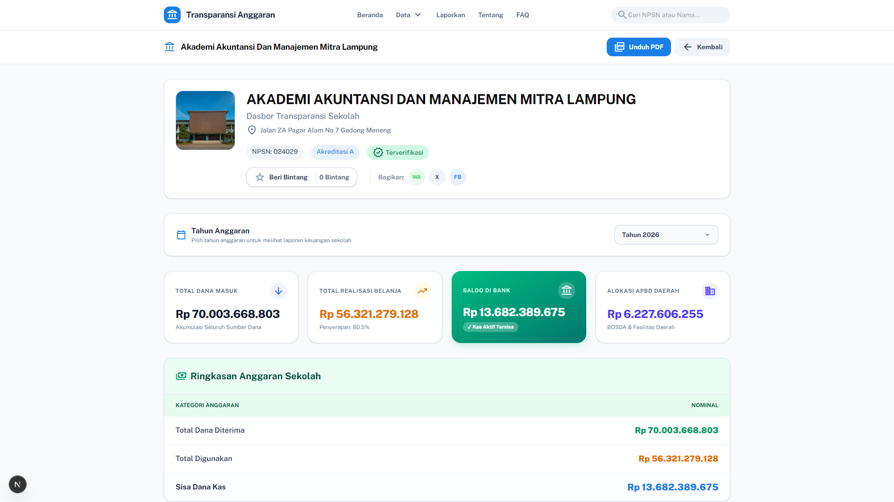
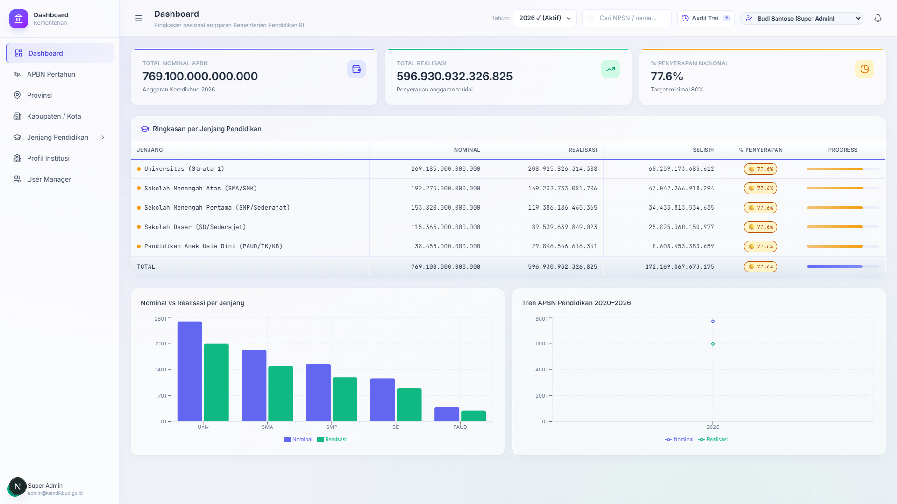
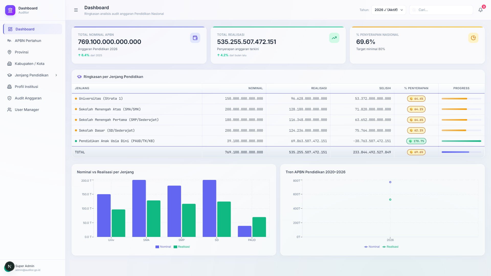
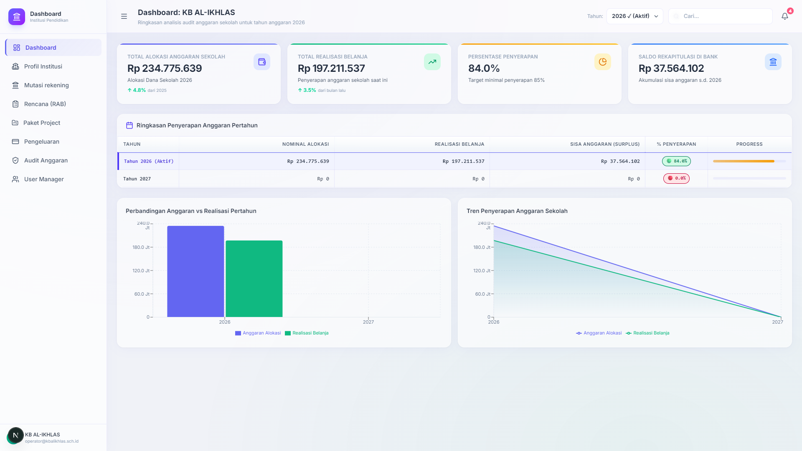

# 🏛️ Integrated Blockchain - Platform Transparansi Anggaran Pendidikan Indonesia

[](https://www.postgresql.org/)
[](https://nextjs.org/)
[](https://react.dev/)
[](https://tailwindcss.com/)
[](LICENSE)

Sistem dasbor terintegrasi multi-peran berbasis *Single Source of Truth* untuk transparansi dan tata kelola anggaran pendidikan Indonesia. Menghubungkan seluruh jenjang pendidikan (**PAUD, SD, SMP, SMA, dan Universitas**) di 38 Provinsi dan 514 Kabupaten/Kota ke dalam satu basis data lokal berkinerja tinggi (*sub-100ms latency*).

---

## 📸 Galeri Dasbor Terintegrasi (8 Ports)

| Portal | Port | Tangkapan Layar |
|---|:---:|---|
| **Portal Transparansi Publik** | `:2020` |  |
| **Detail Institusi Publik (024029)** | `:2020` |  |
| **Dashboard Kementerian (APBN)** | `:2021` |  |
| **Dashboard Bank Penyalur** | `:2022` |  |
| **Dashboard Auditor BPK** | `:2023` |  |
| **Dashboard Institusi Pendidikan** | `:2024` |  |
| **Dashboard APBD Provinsi Lampung** | `:2027` |  |

---

## 🏗️ Arsitektur & Topologi Sistem

Platform ini dibangun dengan arsitektur modular yang memisahkan lapisan persistensi data, gateway API, dan 6 aplikasi dasbor web spesifik peran:

```
┌─────────────────────────────────────────────────────────────────────────────┐
│                          1. DATA PERSISTENCE LAYER                          │
│                                                                             │
│   PostgreSQL 16 Engine (:2025)                                              │
│   └── 35 Public Tables (Master Anggaran, Wilayah, Transaksi, Audit, APBD)   │
│   └── Performance B-Tree Indexes & Cascading Foreign Keys                   │
└──────────────────────────────────────┬──────────────────────────────────────┘
                                       │ Direct SQL Connection Pool
┌──────────────────────────────────────▼──────────────────────────────────────┐
│                          2. LOCAL API PROXY LAYER                           │
│                                                                             │
│   Node.js / Express PostgREST Gateway (:2026)                               │
│   ├── Dynamic Filter Parser (ilike, eq, in, or, order, pagination)          │
│   ├── Quote Stripping & SQL Injection Prevention Engine                     │
│   └── Sub-10ms Fast Response Gateway                                       │
└──────────────────────────────────────┬──────────────────────────────────────┘
                                       │ HTTP REST / PostgREST Protocol
       ┌───────────────────────────────┼───────────────────────────────┐
       │                               │                               │
       ▼                               ▼                               ▼
┌──────────────────────┐   ┌──────────────────────┐   ┌──────────────────────┐
│  Port 2020: Publik   │   │  Port 2021: Kemenkeu │   │   Port 2022: Bank    │
│  Transparansi Warga  │   │  Distribusi Nasional │   │ Rekening & Penyaluran│
└──────────────────────┘   └──────────────────────┘   └──────────────────────┘
       │                               │                               │
       ▼                               ▼                               ▼
┌──────────────────────┐   ┌──────────────────────┐   ┌──────────────────────┐
│  Port 2023: Auditor  │   │ Port 2024: Sekolah   │   │ Port 2027: APBD Prov │
│  Deteksi Anomali AI  │   │ Belanja & SPJ Digital│   │ Mandat 20% Daerah    │
└──────────────────────┘   └──────────────────────┘   └──────────────────────┘
```

---

## 🗺️ Port Mapping & Layanan (8 Ports)

| Port | Layanan / Aplikasi | Direktori | Status Database |
|:---:|---|---|:---:|
| **2020** | Portal Transparansi Publik | `apps/transparansi-anggaran/apps/web-next` | 100% PostgreSQL |
| **2021** | Dashboard Kementerian | `apps/dashboard-kementerian` | 100% PostgreSQL |
| **2022** | Dashboard Bank | `apps/dashboard-bank` | 100% PostgreSQL |
| **2023** | Dashboard Auditor | `apps/dashboard-auditor` | 100% PostgreSQL |
| **2024** | Dashboard Institusi Pendidikan | `apps/dashboard-institusi-pendidikan` | 100% PostgreSQL |
| **2025** | Database PostgreSQL Engine | `pgsql/bin` | Active (35 Tables) |
| **2026** | Proxy API Gateway (PostgREST) | `scripts/proxy-server.js` | Active |
| **2027** | Dashboard APBD Provinsi Lampung | `apps/dashboard-apbd` | 100% PostgreSQL |

---

## 📊 Aturan Multi-Tahun (Selektor Tahun Anggaran)

Seluruh dasbor diselaraskan dengan aturan baku siklus anggaran:
1. **Tahun 2026 (Tahun Anggaran Aktif Berjalan)**:
   - Menampilkan data pagu alokasi, realisasi belanja riil, dan persentase penyerapan secara presisi dari database.
2. **Tahun 2027 (Tahun Anggaran Baru Belum Dialokasikan)**:
   - Alokasi Baru: **`Rp 0`**
   - Realisasi Belanja: **`Rp 0`** (0.0% penyerapan)
   - **Saldo Kas di Bank (Sisa Tahun 2026)**: Diakumulasi dan dibawa maju (*Carry-Forward*) sebagai saldo awal rekening berjalan.

---

## 🚀 Panduan Instalasi & Menjalankan Sistem (VPS, macOS, & Windows)

> 📘 **Panduan lengkap & mendalam tersedia di: [deploy_guide.md](file:///d:/DaVinci/Web%20Development/integrated-blockchain/deploy_guide.md)**

---

### 🐧 Opsi 1: Instalasi Cepat di Linux VPS (Ubuntu / Debian)

```bash
# 1. Clone repository
git clone https://github.com/adimaryanto-stack/integrated-blockchain.git
cd integrated-blockchain

# 2. Atur password postgres dan import database (Otomatis ekstrak gzip & import 35 tabel)
sudo -u postgres psql -c "ALTER USER postgres WITH PASSWORD 'postgres';"
DB_PORT=5432 DB_PASSWORD=postgres node scripts/setup-db.js

# 3. Jalankan seluruh sistem (Proxy API & 6 Dashboard)
chmod +x start.sh
./start.sh
```

---

### 🍎 Opsi 2: Instalasi Cepat di MacBook (macOS)

```bash
# 1. Install Node.js & PostgreSQL via Homebrew
brew install node postgresql@16
brew services start postgresql@16

# 2. Clone repository & Import database 35 tabel
git clone https://github.com/adimaryanto-stack/integrated-blockchain.git
cd integrated-blockchain
DB_PORT=5432 DB_PASSWORD=postgres node scripts/setup-db.js

# 3. Jalankan seluruh aplikasi
chmod +x start.sh
./start.sh
```

---

### 🐳 Opsi 3: Menjalankan Menggunakan Docker Compose (1 Perintah)

```bash
# Start PostgreSQL Database (Port 2025) & Proxy API (Port 2026)
docker compose up -d
```

---

### 🪟 Opsi 4: Menjalankan di Windows Localhost

```powershell
# Buka PowerShell di folder project dan jalankan script master
powershell -ExecutionPolicy Bypass -File "start-all.ps1"
```

---

### 🔍 Skrip Pemeriksaan Kesehatan (Health Check)
```bash
node scripts/check_all_ports.js
```

---

## 📄 Lisensi

Proyek ini dilisensikan di bawah [MIT License](LICENSE).
