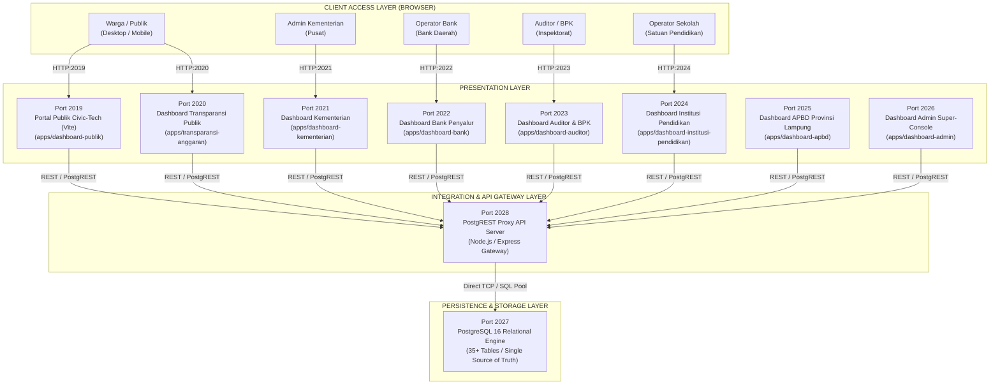
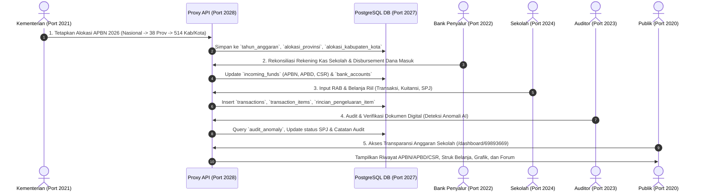

# 🌐 Topologi & Arsitektur Sistem
## Integrated Blockchain - Platform Transparansi Anggaran Pendidikan Indonesia

---

### 1. 🗺️ Topologi Jaringan & Port Mapping

---

### 2. 🔄 Alur Distribusi Data Finansial (Financial Data Flow)

---

### 3. 📊 Cascading Rollup Trigger Model

Ketika nominal anggaran atau realisasi diubah pada salah satu level, sistem menjalankan kalkulasi berjenjang (*cascading math rollup*):

$$\text{APBN Nasional 2026} \xrightarrow{\text{Distribusi}} \sum \text{Alokasi 38 Provinsi} \xrightarrow{\text{Distribusi}} \sum \text{Alokasi 514 Kab/Kota} \xrightarrow{\text{Distribusi}} \sum \text{Sekolah \& Universitas}$$

$$\text{Total Realisasi} = \sum_{\text{bulan}=1}^{12} \text{Pengeluaran Bulanan}$$
$$\text{Sisa Saldo Kas} = \text{Total Alokasi Diterima} - \text{Total Realisasi Belanja}$$
$$\text{Persentase Penyerapan} = \left( \frac{\text{Total Realisasi}}{\text{Total Alokasi}} \right) \times 100\%$$
