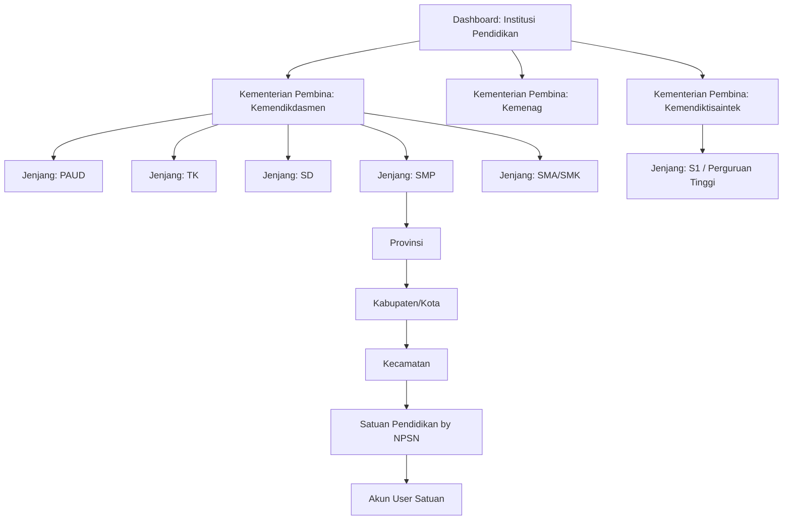
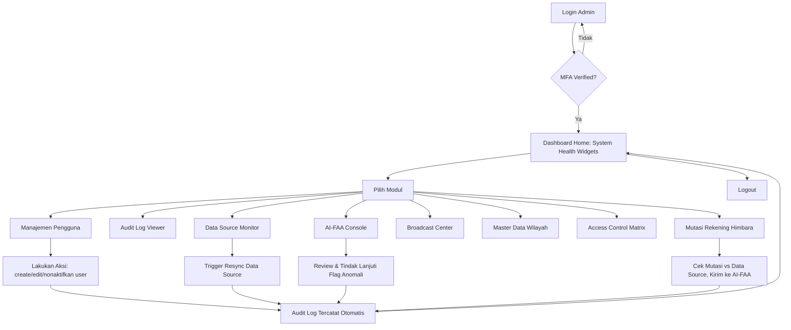
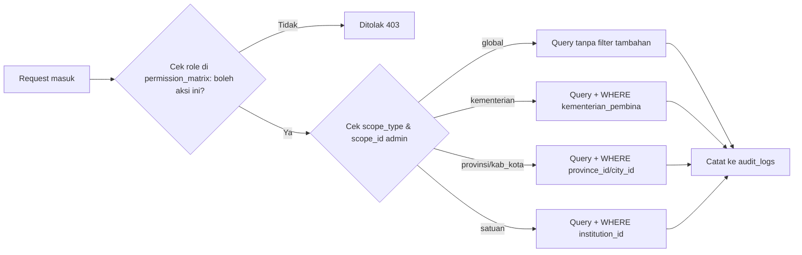
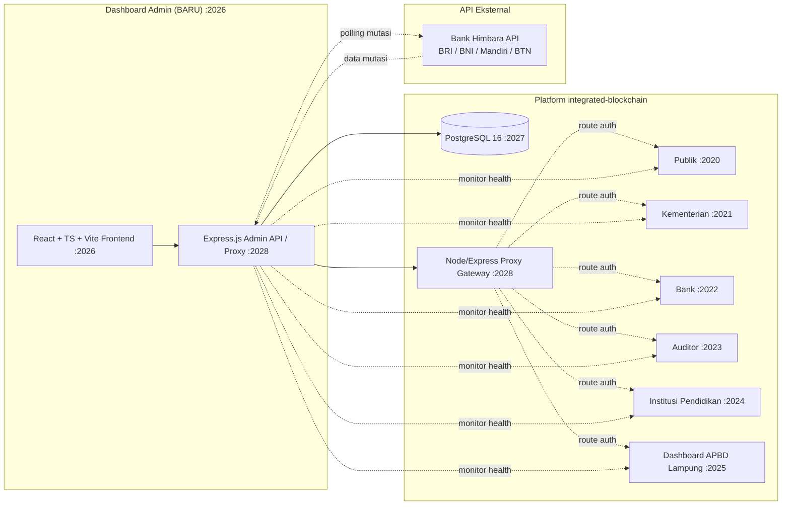

# PRD — Dashboard Admin Integrated (Integrated Blockchain — Anggaran Pendidikan)

> Mengikuti alur **fullstack-workflow**: PRD → MVP Roadmap → Flowchart, sebelum development dimulai.

---

## 1. Project Overview

- **Nama modul:** Dashboard Admin (dashboard ke-6 pada platform `integrated-blockchain`)
- **Port yang diusulkan:** `2026` (mengikuti susunan port: 2020–2024 = 5 dashboard peran, 2025 = Dashboard APBD Lampung, 2026 = Dashboard Admin, 2027 = PostgreSQL, 2028 = Proxy Node/Express Gateway)
- **Deskripsi singkat:** Dashboard admin terpusat (*super-admin console*) untuk mengelola seluruh platform transparansi anggaran pendidikan nasional (APBN + APBD + CSR, 38 provinsi, 514 kabupaten/kota) — mencakup manajemen pengguna lintas 5 dashboard peran yang sudah ada (Publik, Kementerian, Bank, Auditor, Institusi Pendidikan), pemantauan kesehatan sistem, kontrol sumber data, serta pengawasan modul AI-FAA (*AI-Powered Financial Audit Assistant*).
- **Target user:**
  - **Super Admin** — tim inti pengelola platform (akses penuh)
  - **Ops Admin** — tim operasional harian (akses terbatas: monitoring & review, tanpa ubah permission/hapus user)
- **Business goals:**
  - Satu pintu kendali untuk seluruh ekosistem 5+1 dashboard, mengurangi kerja manual lintas sistem
  - Transparansi & akuntabilitas internal lewat audit log yang tidak bisa diubah (*immutable*)
  - Deteksi dini anomali keuangan lewat integrasi AI-FAA sebelum masuk ke laporan publik

---

## 2. Core Features

1. **Manajemen Pengguna & Peran** — CRUD user untuk 5 dashboard existing (Publik, Kementerian, Bank, Auditor, Institusi Pendidikan), terorganisir dalam struktur berlapis (lihat 2.1) agar user sekolah skala nasional tidak bercampur; + reset password, nonaktifkan akun, bulk action per grup
2. **Audit Log Viewer** — log lintas dashboard (siapa, aksi apa, kapan, before/after state), filter by dashboard/aktor/tanggal
3. **Data Source & Ingestion Monitor** — status sinkronisasi APBN/APBD/CSR per provinsi/kab-kota, tombol resync manual, timestamp update terakhir
4. **System Health Dashboard** — status live 5 dashboard (port 2020–2024) + dashboard Lampung (2025) + DB (2027) + proxy (2028): uptime, latency, error rate
5. **AI-FAA Management Console** — daftar anomali yang diflag AI, status review, aktif/nonaktifkan audit per provinsi, log query NL-to-SQL yang dijalankan (untuk audit trail terhadap SQL AST guardrail & PII masking)
6. **Notifikasi & Broadcast** — kirim pengumuman ke role/dashboard tertentu
7. **Master Data Wilayah & Satuan Pendidikan** — kelola data provinsi/kabupaten-kota/satuan pendidikan yang menjadi rujukan seluruh dashboard
8. **Access Control Matrix** — atur permission (view/create/edit/delete) per role per modul, ditambah pengaturan cakupan (scope) per admin: kementerian, wilayah, atau satuan pendidikan (lihat 6.1)
9. **Integrasi API Mutasi Rekening Bank Himbara** — tarik data mutasi rekening secara berkala (polling) dari bank Himbara (BRI, BNI, Mandiri, BTN) yang menampung dana CSR/APBD pendidikan; setiap mutasi dicocokkan otomatis terhadap `data_sources` & diteruskan ke AI-FAA untuk deteksi anomali (mismatch nominal, rekening tak dikenal, transaksi di luar jam kerja); nomor rekening dimasking di UI, hanya Super Admin & role Bank (dashboard 2022) yang bisa lihat detail penuh

### 2.1 Struktur Pengelompokan Pengguna (khusus dashboard Institusi Pendidikan)

Karena user pada dashboard Institusi Pendidikan adalah satuan pendidikan skala nasional (PAUD s.d. S1/Perguruan Tinggi), pengelolaan tidak bisa flat — dibuat hierarki 4 level agar pencarian, filter, dan bulk action tidak bercampur antar jenjang/wilayah:



**Contoh kasus:** aktifkan user pengelola **MIN 1 Pesawaran** →  
`Kemenag → SD (setara MI) → Lampung → Kab. Pesawaran → Kec. Kedondong → MIN 1 Pesawaran → daftar user → Aktifkan`  
Tanpa level Kecamatan, admin harus menyisir manual di antara seluruh satuan se-Kabupaten Pesawaran.

- **Level 0 — Kementerian Pembina:** `Kemendikdasmen` (sekolah negeri PAUD–SMA/SMK), `Kemenag` (madrasah RA/MI/MTs/MA + PTKI), `Kemendiktisaintek` (perguruan tinggi umum) — filter/tab tertinggi sebelum turun ke jenjang, karena satuan yang sama-sama "SD" bisa dibina kementerian berbeda (SD vs MI)
- **Level 1 — Jenjang Pendidikan:** `PAUD`, `TK`, `SD`, `SMP`, `SMA`, `SMK`, `S1` — tab/filter di bawah kementerian, tiap jenjang punya counter jumlah satuan & user aktif
- **Level 2–4 — Wilayah:** Provinsi → Kabupaten/Kota → Kecamatan, memakai master data wilayah yang sama dengan fitur #7
- **Level 5 — Satuan Pendidikan:** diidentifikasi dengan **NPSN** (Nomor Pokok Sekolah Nasional) untuk PAUD–SMA/SMK, atau **NIDN/kode PDDIKTI** untuk S1
- **Level 6 — User:** akun operator/admin satuan pendidikan tersebut (bisa lebih dari satu per satuan)
- **Bulk action per grup:** aktifkan/nonaktifkan/reset password massal berdasarkan kombinasi filter (mis. "semua SD di bawah Kemendikdasmen di Provinsi Jawa Barat")
- **Pencarian cepat:** by NPSN, nama satuan, atau nama user — lintas semua kementerian & jenjang sekaligus, atau dipersempit per kementerian/wilayah/kecamatan
- **Dashboard non-hierarki (Publik, Kementerian, Auditor, Bank):** tidak melalui hierarki di atas — cukup filter by `dashboard`, langsung isi nama/email; khusus dashboard **Bank**, tambahkan `bank_name` (BRI/BNI/Mandiri/BTN) agar staf bank hanya melihat mutasi banknya sendiri

---

## 3. User Flow



---

## 4. Database Schema (schema baru: `admin`, di instance PostgreSQL 16 port 2027 yang sudah ada)

| Tabel | Kolom Utama | Keterangan |
|---|---|---|
| `admin_users` | id, name, email, password_hash, role (`super_admin`\|`ops_admin`\|`admin_kementerian`\|`admin_wilayah`\|`admin_satuan`), scope_type (`global`\|`kementerian`\|`provinsi`\|`kabupaten_kota`\|`satuan`), scope_id (nullable — isinya kementerian_pembina, province_id, city_id, atau institution_id tergantung scope_type), mfa_secret, last_login_at, created_at | Akun admin platform, dengan cakupan akses berjenjang |
| `audit_logs` | id, actor_id, actor_dashboard, action, entity_type, entity_id, before_state (jsonb), after_state (jsonb), ip_address, created_at | Log immutable lintas dashboard |
| `data_sources` | id, name, type (`APBN`\|`APBD`\|`CSR`), province_id, status, last_sync_at, records_count | Status ingestion per sumber data |
| `system_health_snapshots` | id, service_name, port, status, latency_ms, checked_at | Snapshot health check berkala |
| `ai_faa_flags` | id, transaction_id, flagged_reason, severity, reviewed_by, status, created_at | Hasil deteksi anomali AI-FAA |
| `broadcasts` | id, title, message, target_roles (jsonb), sent_by, sent_at | Riwayat broadcast/notifikasi |
| `permission_matrix` | id, role, module, can_view, can_create, can_edit, can_delete | Matriks akses per role per modul (aturan "boleh apa"); cakupan "boleh atas data siapa" diatur lewat `admin_users.scope_type/scope_id`, bukan di tabel ini |
| `bank_mutations` | id, bank_name (`BRI`\|`BNI`\|`Mandiri`\|`BTN`), account_number_masked, transaction_id, amount, transaction_type, transaction_date, province_id, institution_id, matched_data_source_id, match_status, raw_payload (jsonb, encrypted at rest), synced_at | Mutasi rekening Himbara hasil polling API, sudah dicocokkan ke `data_sources` |
| `institution_master` | id, npsn (atau kode PDDIKTI untuk S1), nama_satuan, jenjang (`PAUD`\|`TK`\|`SD`\|`SMP`\|`SMA`\|`SMK`\|`S1`), kementerian_pembina (`Kemendikdasmen`\|`Kemenag`\|`Kemendiktisaintek`\|`Lainnya`), province_id, city_id, kecamatan_id, status, created_at | Master satuan pendidikan nasional, dasar hierarki pengelompokan user |
| `platform_users` | id, dashboard (`Publik`\|`Kementerian`\|`Bank`\|`Auditor`\|`Institusi Pendidikan`), institution_id (nullable, FK khusus dashboard Institusi Pendidikan), bank_name (nullable, khusus dashboard Bank: `BRI`\|`BNI`\|`Mandiri`\|`BTN`), name, email, phone, status, invited_by, created_at | Direktori user lintas dashboard, dipakai modul Manajemen Pengguna |

**Relasi kunci:** `audit_logs.actor_id → admin_users.id`, `data_sources.province_id → provinsi (tabel existing)`, `ai_faa_flags.transaction_id → transaksi (tabel existing di dashboard Kementerian/Auditor)`, `bank_mutations.matched_data_source_id → data_sources.id`, `bank_mutations.transaction_id → ai_faa_flags.transaction_id` (untuk mutasi yang diflag anomali), `platform_users.institution_id → institution_master.id`, `institution_master.province_id/city_id → wilayah (tabel existing)`.

---

## 5. Tech Stack

- **Frontend:** React 18 + TypeScript + Vite (Port `2026`)
- **Backend:** Express.js + TypeScript, berjalan di port `2028` (Proxy / API Gateway)
- **ORM:** Drizzle ORM
- **Database:** PostgreSQL 16 (instance yang sama, port `2027`, schema baru `admin`)
- **Testing:** Vitest
- **Integrasi:** terhubung ke proxy Node/Express (port `2028`) untuk routing lintas dashboard

---

## 6. Authentication & Authorization

### 6.1 Role & Cakupan Akses (Scoped RBAC)

Karena data terstruktur berjenjang (Kementerian → Jenjang → Provinsi → Kab/Kota → Satuan Pendidikan), akses juga dibuat berjenjang — bukan hanya "boleh apa" (role) tapi juga "atas data siapa" (scope). Ini mencegah satu admin pusat harus memegang 514 kab/kota sendirian, dan mencegah admin daerah melihat data di luar wilayahnya.

| Role | Scope Type | Contoh Scope | Hak Akses |
|---|---|---|---|
| **Super Admin** | `global` | – | Semua modul, semua data, satu-satunya yang bisa ubah Access Control Matrix & hapus admin lain |
| **Ops Admin** | `global` | – | View semua data + aksi terbatas (resync, review AI-FAA), tanpa ubah permission/hapus user |
| **Admin Kementerian** | `kementerian` | mis. `Kemenag` | Kelola user & lihat data hanya untuk satuan di bawah kementerian tsb (mis. admin Kemenag tidak bisa lihat data sekolah di bawah Kemendikdasmen) |
| **Admin Wilayah (Dinas Pendidikan)** | `provinsi` / `kabupaten_kota` | mis. Prov. Jawa Barat | Kelola user & lihat data satuan pendidikan di wilayahnya saja, lintas jenjang |
| **Admin Satuan (Kepala Sekolah/Kampus)** | `satuan` | mis. NPSN tertentu | Kelola sub-user di satuannya sendiri (Bendahara/Operator), approve transaksi, lihat data satuannya sendiri saja |
| **Operator/Bendahara Satuan** | `satuan` | (sama dengan atasannya) | Input data transaksi, tidak bisa kelola user lain, tidak bisa approve final |

**Aturan penegakan (enforcement):**
- Setiap request ke API di-cek: `role` menentukan aksi yang boleh (via `permission_matrix`), `scope_type` + `scope_id` menentukan baris data yang boleh diakses (query otomatis ditambahi `WHERE kementerian_pembina = ...` / `WHERE province_id = ...` / `WHERE institution_id = ...` sesuai scope).
- Admin dengan scope sempit **tidak bisa** membuat admin baru dengan scope lebih luas dari dirinya sendiri (mis. Admin Wilayah tidak bisa membuat Admin Kementerian).
- Semua aksi tetap tercatat di `audit_logs`, termasuk scope pelaku, sehingga bisa dilacak *"Admin Wilayah Jawa Barat mengubah user X di NPSN Y"*.



### 6.2 Ketentuan Umum

- **MFA (TOTP) wajib** untuk role `super_admin` dan `admin_kementerian` (scope luas → risiko lebih tinggi).
- Session timeout: 30 menit idle.
- Semua aksi tercatat otomatis ke `audit_logs` (tidak bisa dihapus/diedit dari UI).
- **Data mutasi bank Himbara:** nomor rekening full hanya tampil untuk Super Admin + role Bank (dashboard 2022); role lain hanya lihat versi masked. Kredensial API bank (API key/OAuth token per bank) disimpan terenkripsi, tidak pernah tampil di UI maupun log.

---

## 7. API Endpoints

```
POST   /api/admin/login
POST   /api/admin/mfa/verify
POST   /api/admin/logout

GET    /api/admin/users?dashboard=&kementerian_pembina=&jenjang=&province_id=&city_id=&kecamatan_id=&institution_id=&bank_name=
POST   /api/admin/users
PATCH  /api/admin/users/:id
DELETE /api/admin/users/:id
POST   /api/admin/users/bulk-action

GET    /api/admin/institutions?kementerian_pembina=&jenjang=&province_id=&city_id=&kecamatan_id=
POST   /api/admin/institutions
GET    /api/admin/institutions/:id/users

GET    /api/admin/audit-logs

GET    /api/admin/data-sources
POST   /api/admin/data-sources/:id/resync

GET    /api/admin/system-health

GET    /api/admin/ai-faa/flags
PATCH  /api/admin/ai-faa/flags/:id

GET    /api/admin/broadcasts
POST   /api/admin/broadcasts

GET    /api/admin/permissions
PUT    /api/admin/permissions

GET    /api/admin/bank-mutations
GET    /api/admin/bank-mutations/:id
POST   /api/admin/bank-mutations/sync
```

---

## 8. MVP Roadmap

- **Sprint 1 — Fondasi & Kendali Pengguna**
  - Login + MFA
  - Dashboard Home (widget system health dasar)
  - Master data satuan pendidikan (`institution_master`) + import awal NPSN nasional
  - Manajemen Pengguna (CRUD lintas 5 dashboard, dengan filter/hierarki kementerian → jenjang → wilayah → satuan untuk Institusi Pendidikan, bulk action per grup)
  - Scoped RBAC dasar: `admin_users.scope_type/scope_id` + enforcement query filter di semua endpoint

- **Sprint 2 — Visibilitas & Data**
  - Audit Log Viewer + filter (termasuk scope pelaku)
  - Data Source & Ingestion Monitor + tombol resync

- **Sprint 3 — Kontrol Lanjutan**
  - AI-FAA Management Console
  - Access Control Matrix editor (permission per role + scope per admin)
  - Integrasi API Mutasi Rekening Bank Himbara + auto-matching ke Data Source

- **Sprint 4 — Penyempurnaan**
  - Broadcast & Notification Center
  - Master Data Wilayah & Satuan Pendidikan
  - Export laporan (CSV/PDF)

---

## System Architecture Flowchart


