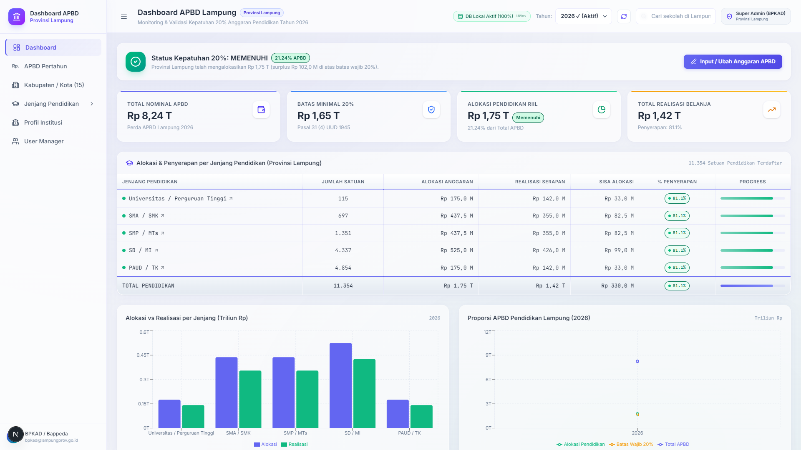

# 🏛️ Dashboard APBD Provinsi Lampung (Port 2025)

> **Sistem Informasi Manajemen, Monitoring & Validasi Alokasi APBD Pendidikan Provinsi Lampung Berbasis Database PostgreSQL Lokal.**



---

## 🌟 Ikhtisar Aplikasi

Dashboard APBD Provinsi Lampung dirancang khusus untuk Pemerintah Provinsi (BPKAD & Bappeda) guna memantau kepatuhan mandatori undang-undang (Pasal 31 ayat 4 UUD 1945 — minimal 20% APBD dialokasikan untuk pendidikan) serta mendistribusikan anggaran secara transparan ke seluruh 15 Kabupaten/Kota dan 11.354 satuan pendidikan di Lampung.

Aplikasi ini berjalan pada **Port 2025** dan terhubung 100% secara langsung ke database lokal **PostgreSQL 16 (Port 2027)** melalui **Proxy API Server (Port 2028)**.

---

## 🚀 Fitur Utama

1. **Executive Dashboard Kepatuhan 20% (`/dashboard`)**:
   - Validasi otomatis status kepatuhan anggaran (*MEMENUHI* vs *BELUM MEMENUHI*).
   - Indikator 4 Metrik Utama: Total Nominal APBD, Batas Wajib 20%, Alokasi Pendidikan Riil, dan Realisasi Belanja Total.
   - Ringkasan distribusi anggaran per jenjang pendidikan (Universitas, SMA/SMK, SMP/MTs, SD/MI, PAUD/TK).
   - Grafik tren multi-tahun (Historis vs Realisasi).

2. **Pengelolaan APBD Pertahun (`/dashboard/apbd`)**:
   - Penetapan dan penguncian status pagu anggaran per tahun (Draft, Active, Closed).
   - Input modal untuk pembaruan alokasi APBD dan pencatatan riwayat audit log.

3. **Breakdown 15 Kabupaten / Kota (`/dashboard/kabupaten-kota`)**:
   - Tabel spreadsheet alokasi 15 Kabupaten/Kota di Lampung.
   - Fitur inline editing cepat dengan auto-save ke database PostgreSQL.
   - Export spreadsheet data daerah ke format Microsoft Excel (.xlsx).

4. **Monitoring Jenjang Pendidikan (`/dashboard/jenjang/[jenjang]`)**:
   - Halaman detail untuk masing-masing jenjang: `/universitas`, `/sma`, `/smp`, `/sd`, `/paud`.
   - Filter instan berdasarkan 15 Kabupaten/Kota dan pencarian NPSN / Nama Sekolah.
   - Export data sekolah ke format Excel.

5. **Profil Institusi & Multi-Sumber Dana (`/dashboard/profil-institusi`)**:
   - Pelacakan detail sekolah di Lampung (contoh: Universitas Lampung - NPSN 024029).
   - Transparansi 3 sumber pembiayaan: **APBD Daerah**, **APBN Pusat**, dan **CSR Mitra Industri**.
   - Saldo rekening kas di bank riil per satuan pendidikan.

6. **User & Role Manager (`/dashboard/users`)**:
   - Manajemen akses pengguna (Super Admin BPKAD, Auditor BPK, Operator Disdik, Kepala Sekolah).
   - Kontrol status aktif dan pencatatan log aktivitas sistem.

---

## 🏗️ Arsitektur & Teknologi

- **Framework**: Next.js 15 (App Router, Turbopack)
- **Language**: TypeScript 5
- **Styling**: Tailwind CSS & Glassmorphism Theme
- **Charts**: Recharts & Lucide React
- **Export Utility**: ExcelJS & FileSaver
- **Database**: PostgreSQL 16 (Port 2027) via PostgREST / Supabase Client (Port 2028)

---

## ⚙️ Cara Menjalankan

```bash
# Masuk ke direktori dashboard APBD
cd apps/dashboard-apbd

# Install dependencies
npm install

# Jalankan server development di port 2025
npm run dev
```

Akses aplikasi di peramban web: **[http://localhost:2025](http://localhost:2025)**
