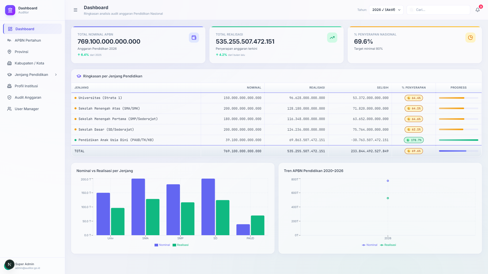

# 🔍 Dashboard Auditor (Port 2023)

> **Sistem Audit Anggaran Pendidikan Nasional (BPK & Itjen Kemendikbudristek) Berbasis AI Anomaly Detection & PostgreSQL Lokal.**



---

## 🌟 Ikhtisar Aplikasi

Dashboard Auditor dirancang khusus untuk Badan Pemeriksa Keuangan (BPK) dan Inspektorat Jenderal Kementerian guna melakukan pengawasan, audit kepatuhan SPJ, deteksi anomali harga/pajak berbasis AI, serta verifikasi aliran dana pendidikan dari tingkat pusat hingga ke 38 provinsi dan satuan pendidikan.

Aplikasi ini berjalan pada **Port 2023** dan terhubung 100% secara langsung ke database lokal **PostgreSQL 16 (Port 2025)** melalui **Proxy API Server (Port 2026)**.

---

## 🚀 Fitur Utama

1. **National Audit Executive Dashboard (`/dashboard`)**:
   - Agregat pagu APBN Pendidikan Nasional (Rp 665,02 Triliun).
   - Metrik kepatuhan penyerapan dan status anomali nasional.
   - Grafik tren multi-tahun dan perbandingan alokasi vs realisasi per jenjang.

2. **Audit APBN Pertahun (`/dashboard/apbn`)**:
   - Rekapitulasi penetapan pagu APBN per tahun anggaran.
   - Analisis audit varians anggaran lintas tahun (2026 aktif vs 2027 carry-forward).

3. **Spreadsheet Audit Provinsi (`/dashboard/provinsi`)**:
   - Audit penyerapan dana pada 38 Provinsi di Indonesia.
   - Ranking provinsi berdasarkan kecepatan dan akurasi penyerapan anggaran.

4. **Spreadsheet Audit Kabupaten / Kota (`/dashboard/kabupaten-kota`)**:
   - Pemeriksaan distribusi dana ke 514 Kabupaten/Kota.
   - Deteksi dini SILPA (Sisa Lebih Perhitungan Anggaran).

5. **Pemeriksaan Jenjang Pendidikan (`/dashboard/jenjang/[jenjang]`)**:
   - Audit spesifik jenjang: `/universitas`, `/sma`, `/smp`, `/sd`, `/paud`.
   - Pelacakan rasio belanja modal vs operasional per sekolah.

6. **Profil Keuangan Institusi (`/dashboard/profil-institusi`)**:
   - Rincian rekam jejak audit institusi (contoh: Universitas Lampung - NPSN 024029).
   - Verifikasi 3 sumber dana (APBN, APBD, CSR) dan saldo kas di bank.

7. **AI Anomaly & Fraud Detector (`/dashboard/audit`)**:
   - Deteksi otomatis transaksi duplikat, markup harga tidak wajar, dan anomali faktur pajak.
   - Workflow investigasi audit: *Belum Diproses*, *Dalam Investigasi*, *Selesai*.

8. **User & Access Governance (`/dashboard/users`)**:
   - Manajemen peran auditor (Senior Auditor, Forensic Auditor, Field Inspector).

---

## 📊 Logika Selektor Tahun (2026 vs 2027)

- **Tahun 2026 (Tahun Anggaran Aktif)**:
  - Total APBN Pendidikan: Rp 665.024.819.000.000 (Rp 665,02 Triliun)
  - Realisasi Penyerapan: Rp 518.719.358.820.000 (78.0%)
- **Tahun 2027 (Anggaran Baru Belum Dialokasikan)**:
  - Total Alokasi Baru: Rp 0
  - Realisasi Belanja: Rp 0
  - Sisa Saldo Kas Bank: Carry-Forward dari sisa tahun 2026

---

## ⚙️ Cara Menjalankan

```bash
cd apps/dashboard-auditor
npm install
npm run dev -- -p 2023
```

Akses aplikasi di: **[http://localhost:2023](http://localhost:2023)**