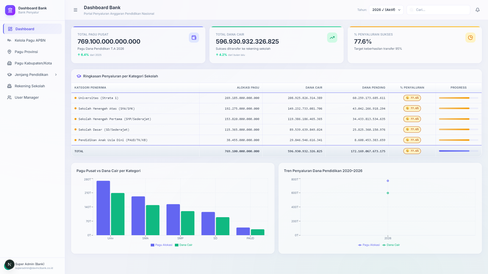

# 🏛️ Dashboard Bank Penyalur (Port 2022)

> **Portal Operasional Bank Penyalur (Himbara / Bank Mitra) untuk Monitoring Rekening Escrow, Giro Penyaluran, dan Rekonsiliasi Kas Sekolah Berbasis PostgreSQL Lokal.**



---

## 🌟 Ikhtisar Aplikasi

Dashboard Bank Penyalur merupakan sistem perbankan terintegrasi yang digunakan oleh Bank Mitra Penyalur Dana Pendidikan (seperti BRI, BNI, Mandiri) untuk memantau pagu dana pusat, mengelola rekening penampung (Escrow), mengeksekusi pencairan bertahap (triwulan Q1-Q4), serta melakukan rekonsiliasi transfer otomatis langsung ke rekening satuan pendidikan di seluruh Indonesia.

Aplikasi ini berjalan pada **Port 2022** dan terhubung 100% secara langsung ke database lokal **PostgreSQL 16 (Port 2027)** melalui **Proxy API Server (Port 2028)**.

---

## 🚀 Fitur Utama

1. **Executive Treasury Dashboard (`/dashboard`)**:
   - Total Saldo Escrow APBN Pendidikan Nasional (Rp 665,02 Triliun).
   - Total Dana Tersalurkan ke Rekening Sekolah dan Sisa Saldo Giro.
   - Status keberhasilan transaksi kliring dan real-time throughput.

2. **Monitoring Pagu APBN (`/dashboard/apbn`)**:
   - Pelacakan alokasi pagu APBN per tahun anggaran.
   - Analisis jadwal pencairan dana BOS/BOP nasional.

3. **Penyaluran Wilayah Provinsi (`/dashboard/provinsi`)**:
   - Distribusi dana ke 38 Kantor Wilayah Bank (Kanwil).
   - Status pencairan per provinsi dengan spreadsheet interface.

4. **Penyaluran Area Kabupaten / Kota (`/dashboard/kabupaten-kota`)**:
   - Pemantauan rekening penampung cabang di 514 Kantor Cabang Bank (KCP).

5. **Penyaluran per Jenjang Pendidikan (`/dashboard/jenjang/[jenjang]`)**:
   - Rekapitulasi penyaluran ke rekening kampus dan sekolah (`/universitas`, `/sma`, `/smp`, `/sd`, `/paud`).

6. **Profil Rekening Institusi (`/dashboard/profil-institusi`)**:
   - Verifikasi nomor rekening, bank penerima, nama pemilik rekening, dan saldo kas riil per sekolah (contoh: Universitas Lampung - 024029).

---

## 📊 Logika Selektor Tahun (2026 vs 2027)

- **Tahun 2026 (Aktif)**:
  - Total Pagu Penyaluran: Rp 665.024.819.000.000 (Rp 665,02 Triliun)
  - Total Dana Tersalurkan: Rp 518.719.358.820.000 (78.0%)
- **Tahun 2027 (Anggaran Baru Belum Dialokasikan)**:
  - Total Penyaluran Baru: Rp 0
  - Realisasi Penyaluran: Rp 0
  - Saldo Kas Bank Sekolah: Carry-Forward sisa saldo tahun 2026

---

## ⚙️ Cara Menjalankan

```bash
cd apps/dashboard-bank
npm install
npm run dev -- -p 2022
```

Akses aplikasi di: **[http://localhost:2022](http://localhost:2022)**
