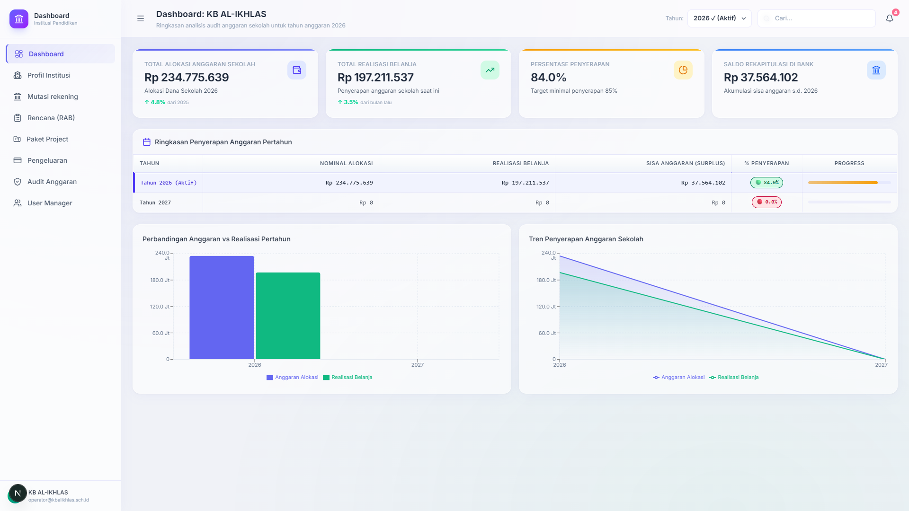

# 🏫 Dashboard Institusi Pendidikan (Port 2024)

> **Sistem Manajemen Rencana Anggaran (RAB), Rekapitulasi Kas Bank, dan Pencatatan Belanja Sekolah Berbasis PostgreSQL Lokal.**



---

## 🌟 Ikhtisar Aplikasi

Dashboard Institusi Pendidikan merupakan platform operasional satuan pendidikan (sekolah/madrasah/kampus) dalam mengelola pagu anggaran, merencanakan belanja (RAB), memantau transaksi mutasi kas bank, serta mencocokkan kuitansi pengeluaran dengan bantuan OCR Tesseract.

Aplikasi ini berjalan pada **Port 2024** dan terhubung 100% secara langsung ke database lokal **PostgreSQL 16 (Port 2025)** melalui **Proxy API Server (Port 2026)**.

---

## 🚀 Fitur Utama

1. **Ringkasan Akun Sekolah (`/dashboard`)**:
   - Menampilkan profil sekolah aktif (contoh: KB AL-IKHLAS - NPSN 69893669).
   - 4 Metrik Utama: Total Alokasi Anggaran, Total Realisasi Belanja, % Penyerapan, dan Saldo Rekapitulasi Kas di Bank.
   - Tabel ringkasan penyerapan tahunan dengan akumulasi saldo sisa.

2. **Daftar Rencana (RAB) (`/dashboard/rencana-anggaran`)**:
   - Perencanaan item belanja operasional sekolah.
   - Deteksi anomali harga dan kuitansi ganda.
   - Dialog interaktif diskusi RAB.

3. **Paket Project & Pengadaan (`/dashboard/rencana-anggaran/paket-project`)**:
   - Manajemen paket proyek sarana dan prasarana sekolah.
   - Status progres fisik dan keuangan proyek.

4. **Mutasi Rekening Bank (`/dashboard/mutasi-rekening`)**:
   - Rekapitulasi mutasi dana masuk (Kredit) dan penarikan belanja (Debet).
   - Transparansi saldo awal bawaan (*Carry-Forward*) antar tahun anggaran.

5. **Pencatatan Belanja & Pengeluaran (`/dashboard/pengeluaran`)**:
   - Input transaksi belanja riil dengan bukti kuitansi.
   - Scan kuitansi otomatis berbasis OCR Tesseract.js.

6. **Audit Anggaran & AI Anomaly Detection (`/dashboard/audit`)**:
   - Analisis otomatis transaksi janggal oleh AI.
   - Verifikasi kepatuhan perpajakan (PPN/PPh).

7. **Profil Institusi (`/dashboard/profil-institusi/[id]`)**:
   - Detail profil sekolah, legalitas, dan struktur sumber pembiayaan (APBN BOP PAUD, APBD Daerah, CSR).

8. **User Manager (`/dashboard/users`)**:
   - Pengelolaan akun bendahara, kepala sekolah, dan operator.

---

## 📊 Logika Selektor Tahun (2026 vs 2027)

- **Tahun 2026 (Aktif)**:
  - Total Alokasi: Rp 234.775.639
  - Total Realisasi: Rp 197.211.537
  - % Penyerapan: 84.0%
  - Saldo Kas di Bank: Rp 37.564.102
- **Tahun 2027 (Anggaran Baru Belum Dialokasikan)**:
  - Total Alokasi Baru: Rp 0
  - Realisasi Belanja: Rp 0 (0.0% penyerapan)
  - **Saldo Kas di Bank (Sisa Tahun 2026)**: Rp 37.564.102

---

## ⚙️ Cara Menjalankan

```bash
cd apps/dashboard-institusi-pendidikan
npm install
npm run dev -- -p 2024
```

Akses aplikasi di: **[http://localhost:2024](http://localhost:2024)**
