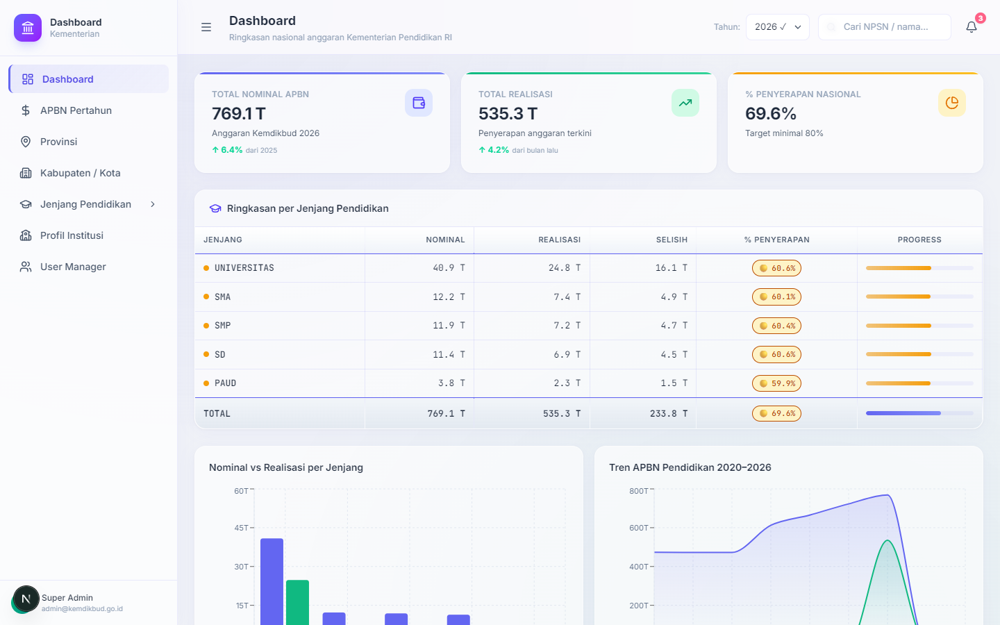
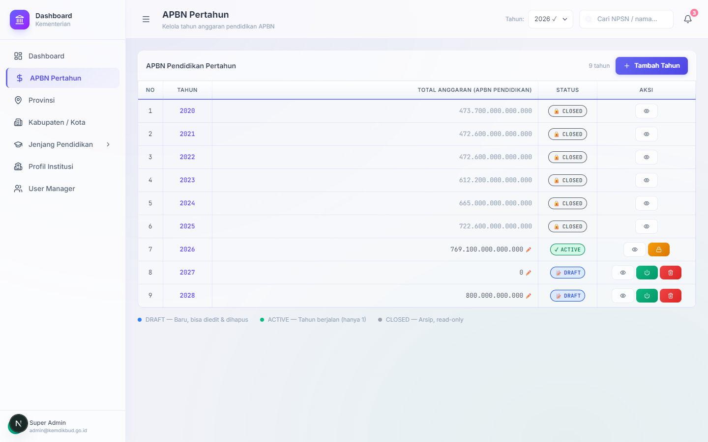
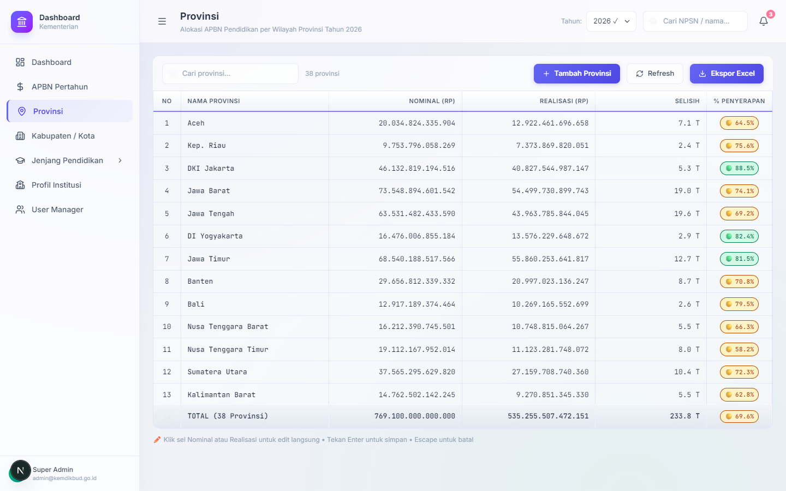
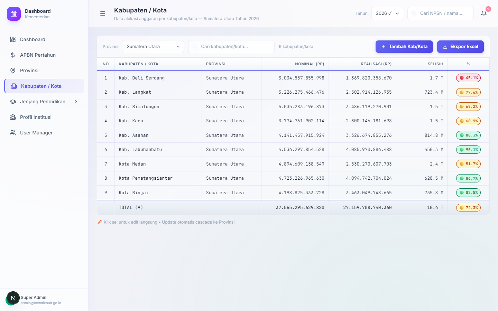
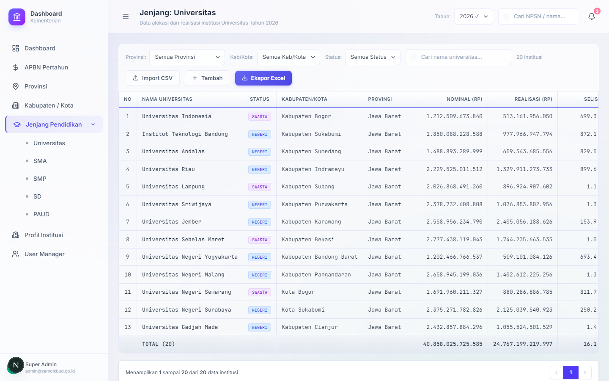
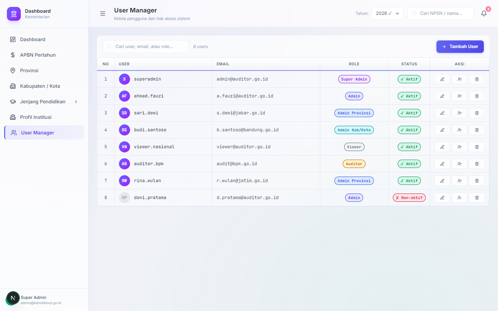

# Dashboard Kementerian 🇮🇩

Sistem informasi modern bergaya _spreadsheet_ untuk pemantauan, alokasi, dan transparansi Anggaran Pendapatan dan Belanja Negara (APBN) di sektor Pendidikan Indonesia.

Aplikasi ini menyajikan *dashboard* dengan performa tinggi yang memungkinkan instansi terkait (mulai dari level nasional hingga institusi pendidikan seperti sekolah dan universitas) memantau alokasi vs realisasi anggaran secara berjenjang dan real-time.

---

## ⚡ Quick Deploy to Vercel

Dapatkan aplikasi ini online dalam satu klik menggunakan tombol di bawah ini:

[](https://vercel.com/new/clone?repository-url=https%3A%2F%2Fgithub.com%2Fadimaryanto-stack%2FDashboard-Kementerian)

---

## ✨ Fitur Utama

- **Navigasi Berjenjang & Sinkronisasi Presisi (2-Way Cascading)**: Pemantauan dan alokasi dana berjenjang mulai dari **APBN Nasional ↔ 38 Provinsi ↔ 514 Kabupaten/Kota ↔ 367.865 Institusi Pendidikan** (Universitas, SMA, SMP, SD, PAUD) dengan kalkulasi otomatis selisih 0 rupiah.
- **Antarmuka Bergaya Spreadsheet**: 
  - Input data nominal dan realisasi secara langsung *(inline editing)*.
  - Perhitungan **Selisih** dan **Persentase Penyerapan** otomatis (kaskade) dari bawah ke atas dan atas ke bawah.
- **Koneksi Database PostgreSQL & Server-Side Paginasi**:
  - Terhubung langsung ke **PostgreSQL Database** via proxy REST API (**PostgREST**).
  - Paginasi server-side **100 sekolah per halaman** mencakup seluruh 38 provinsi dengan pengurutan presisi 3 tingkat (Provinsi A-Z ➔ Kab/Kota A-Z ➔ Nama Institusi A-Z).
- **Audit Trail Real-Time Murni**: Histori log perubahan data asli real-time yang merekam user, role, entitas, nilai lama ➔ nilai baru, dan timestamp tanpa data dummy/sample.
- **Visualisasi Data**: *Dashboard* analitik dengan metrik utama dan grafik tren tahunan menggunakan *Recharts*.
- **Desain Modern (Glassmorphism)**: UI/UX premium dengan *Light Mode*, efek *frosted glass* (transparan-blur), serta aksen warna yang halus.
- **Manajemen Pengguna & Pengaturan Peran (RBAC Matrix)**: Role-Based Access Control 6 Tingkat (`Super Admin`, `Admin Pusat`, `Admin Provinsi`, `Admin Kab/Kota`, `Public Researcher`, `Auditor BPK`) dilengkapi matrik pengaturan pembagian tugas interaktif.

---

## 🛠️ Stack Teknologi

Sistem ini dibangun menggunakan ekosistem *web modern* dengan performa tinggi:

- **Framework**: [Next.js 16 (App Router)](https://nextjs.org/) & React 19
- **Database Backend**: PostgreSQL Database (Port 2025) & PostgREST Proxy Engine (Port 2026)
- **Bahasa**: TypeScript (Strict Typing)
- **Styling**: [Tailwind CSS v4](https://tailwindcss.com/) dengan arsitektur variabel berbasis `@theme`.
- **State Management**: [Zustand](https://github.com/pmndrs/zustand)
- **Ikon & Grafik**: Lucide React & Recharts
- **Export Excel**: ExcelJS + file-saver

---

## 📂 Struktur Proyek

```text
dashboard-kementerian/
├── app/                  # Next.js App Router (Halaman & Layout)
│   ├── dashboard/        # Halaman utama aplikasi (APBN, Provinsi, Kab/Kota, dll.)
│   ├── globals.css       # Root stylesheet (Tailwind v4 tokens & utility classes)
│   └── layout.tsx        # Root layout (Provider & Font)
├── components/           # Komponen UI Reusable
│   ├── layout/           # Sidebar, Header, Shell
│   └── ui/               # PctBadge, StatusBadge, MetricCard, dll.
├── lib/                  # Utilitas dan Data
│   ├── data/             # API data stubs (siap integrasi InsForge)
│   ├── store/            # Global state (Zustand)
│   └── utils/            # Fungsi format mata uang, persentase, class merger (clsx)
├── PRD.md                # Consolidated Product Requirements Document & MVP Roadmap
└── types/                # Definisi tipe data TypeScript (Interface)
```

---

## 🚀 Memulai Pengembangan (Development)

Pastikan Anda memiliki [Node.js](https://nodejs.org/) (versi 18+ disarankan) terinstal di sistem Anda.

1. **Clone repository ini**
   ```bash
   git clone https://github.com/adimaryanto-stack/Dashboard-Kementerian.git
   cd Dashboard-Kementerian
   ```

2. **Install dependencies**
   ```bash
   npm install
   ```

3. **Jalankan Development Server**
   ```bash
   npm run dev
   ```

4. **Akses Aplikasi**
   Buka [http://localhost:3000](http://localhost:3000) di browser Anda. Halaman utama berada pada rute `/dashboard`.

---

## 📷 Screenshots Aplikasi (Localhost)

Berikut adalah beberapa tampilan utama dari **Dashboard Kementerian** yang berjalan secara lokal:

| 📊 Halaman Utama Dashboard | 💰 Pengelolaan APBN Pertahun |
|:---:|:---:|
|  |  |
| *Ringkasan APBN Pendidikan Nasional, Chart Tren, & Progress* | *Manajemen status tahun anggaran (Draft, Active, Closed)* |

| 📍 Spreadsheet Provinsi | 🏛️ Spreadsheet Kabupaten / Kota |
|:---:|:---:|
|  |  |
| *Tabel spreadsheet interaktif tingkat provinsi dengan Inline Editing* | *Tabel spreadsheet tingkat Kabupaten/Kota dengan filter cascading* |

| 🎓 Sub-Menu Jenjang Pendidikan | 👥 User Manager (RBAC) |
|:---:|:---:|
|  |  |
| *Detail alokasi & realisasi per sekolah/universitas dengan pagination* | *Manajemen pengguna lengkap dengan pengaturan Role & Status* |

---

## 📖 Dokumentasi Lengkap (PRD)

Dokumentasi rancangan produk, arsitektur, skema database, dan peta jalan (roadmap) pengembangan telah digabung menjadi satu file untuk memudahkan referensi:
- Cek file **[`PRD.md`](./PRD.md)**
- Detail target/checklist fungsionalitas minimal layak produk: **[`MVP.md`](./MVP.md)**

---

## 📝 Changelog & Riwayat Perubahan

### **[1.5.0] - 01-08-2026**
- **Integrasi Database PostgreSQL & PostgREST**: Terhubung langsung ke **PostgreSQL Database** (Port 2025) via proxy API **PostgREST** (Port 2026) untuk sinkronisasi data APBN, 38 Provinsi, 514 Kab/Kota, 367.865 Institusi Pendidikan, dan pengguna.
- **Kalkulasi & Sinkronisasi Presisi 2-Arah (2-Way Cascading Sync)**:
  - *Top-Down Cascading*: Perubahan nominal alokasi provinsi otomatis mendistribusikan ulang secara proporsional ke 514 kabupaten/kota di PostgreSQL DB.
  - *Bottom-Up Cascading*: Perubahan nominal di tingkat kabupaten/kota otomatis mengkalkulasi ulang alokasi provinsi dan total APBN nasional.
  - Penyelarasan nominal APBN 2026 menjadi **Rp 769.100.000.000.000 (769,1 Triliun)** dengan selisih 0 rupiah di seluruh hirarki DB.
- **Matriks Pengaturan Peran & Pembagian Tugas (RBAC Matrix)**:
  - Ditambahkan Tab Navigasi *Pengaturan Peran & Pembagian Tugas (RBAC Matrix)* pada menu **User Manager** (`/dashboard/users`).
  - Fitur pengeditan deskripsi dan daftar tugas utama per peran khusus Super Admin dengan pencatatan audit log otomatis.
- **Audit Trail Real-Time Murni**:
  - Penghapusan total data dummy/sample `INITIAL_AUDIT_LOGS`.
  - Perekaman histori log asli real-time mencakup user aktif, role, nama entitas, nilai lama ➔ nilai baru, dan timestamp dengan penyimpanan persistent.
- **Paginasi Server-Side 100 Sekolah & Pengurutan A-Z**:
  - Mengimplementasikan paginasi 100 sekolah per halaman langsung dari PostgreSQL DB menggunakan header `Prefer: count=exact`.
  - Pengurutan presisi 3 tingkat: Provinsi A-Z ➔ Kab/Kota A-Z ➔ Nama Institusi A-Z.
- **Pembaruan Role Viewer ➔ Public Researcher**:
  - Mengubah kode peran `VIEWER` menjadi **`PUBLIC_RESEARCHER`** (*Public Researcher*) pada tipe TypeScript, UI badge warna emerald, dan database PostgreSQL.

---

### **[1.4.1] - 24-06-2026**
- Menyelaraskan seluruh dokumen roadmap dan file konfigurasi ke versi **1.4.1**.
- Menambahkan dokumentasi **Sprint 5 (User Manager & RBAC)** ke dalam peta jalan MVP di berkas `PRD.md`.
- Memperbarui label footer notifikasi pada komponen header aplikasi agar konsisten menampilkan `"Dashboard Kementerian v1.4.1"`.

---

### **[1.4.0] - 24-06-2026**
- Ditambahkan menu **User Manager** lengkap dengan data mock user yang komprehensif, fitur CRUD (Tambah/Edit/Hapus), dan status aktif/nonaktif.
- Ditambahkan mekanisme **Role-Based Access Control (RBAC)** untuk membatasi interaksi (seperti inline spreadsheet editing) bagi pengguna dengan peran `VIEWER` atau `AUDITOR`, atau admin dengan cakupan wilayah berbeda.
- Ditambahkan visualisasi grafik tren pengeluaran bulanan dan alokasi per sumber dana di menu **Profil Institusi**.
- Ditambahkan screenshot fungsionalitas aplikasi di localhost (Port 3009) yang dirujuk ke dalam `README.md`.
- Ditambahkan file target roadmap/checklist minimal layak produk [`MVP.md`](./MVP.md) ke struktur project.

---

### **[1.3.0] - 13-06-2026**
- **Vercel Deploy Readiness:**
  - Ditambahkan tombol **Deploy with Vercel** untuk kemudahan kloning dan penyebaran demo.
  - Ditambahkan konfigurasi `vercel.json` untuk pengaturan Next.js build.
- **Pembersihan Kode InsForge:**
  - Dihapus folder konfigurasi `.insforge/` beserta references terkait credential data.
  - Dihapus seluruh referensi dokumentasi dan setup backend InsForge dari `README.md` dan `PRD.md`.
- **Restorasi Mock Data:**
  - Dikembalikan kode mock data lengkap pada `lib/data/index.ts` agar aplikasi langsung berfungsi secara independen di platform Vercel tanpa dependency database eksternal.

---

### **[1.0.0] - 13-05-2026**
- Rilis inisial Dashboard Anggaran Pendidikan Indonesia dengan antarmuka spreadsheet interaktif (inline editing, cascade update, dan export Excel menggunakan ExcelJS).