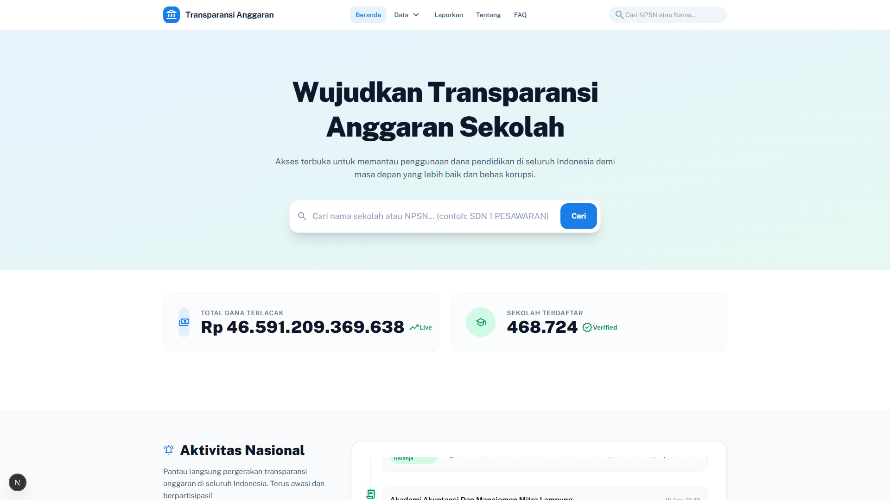

# 🌐 Portal Transparansi Anggaran Pendidikan (Port 2020)

> **Portal Publik Transparansi Aliran Dana Pendidikan Nasional, Pelacakan Real-Time Sekolah, dan Eksplorasi Multi-Sumber (APBN, APBD, CSR).**




---

## 🌟 Ikhtisar Aplikasi

Portal Transparansi Anggaran Pendidikan merupakan antarmuka publik yang memungkinkan seluruh masyarakat Indonesia, pemerhati pendidikan, jurnalis, dan akademisi untuk melacak dan memverifikasi aliran dana pendidikan secara terbuka mulai dari APBN Pusat, 38 Provinsi, 514 Kabupaten/Kota, hingga satuan pendidikan di tingkat tapak.

Aplikasi ini berjalan pada **Port 2020** dan terhubung 100% secara langsung ke database lokal **PostgreSQL 16 (Port 2025)** melalui **Proxy API Server (Port 2026)**.

---

## 🚀 Fitur Utama

1. **Lacak Aliran Dana Nasional (`/aliran-dana`)**:
   - Visualisasi diagram alir interaktif dari Kementerian Pusat ke daerah dan satuan pendidikan.
   - Pengecekan status verifikasi blockchain dan audit rekonsiliasi.

2. **Detail Satuan Pendidikan (`/dashboard/[npsn]`)**:
   - Pencarian sekolah berdasarkan NPSN (contoh: `/dashboard/024029` untuk Universitas Lampung).
   - Rincian penerimaan 3 pilar: APBN, APBD Daerah, dan CSR Industri.
   - Realisasi belanja bulanan, saldo kas bank, dan dokumen pertanggungjawaban.

3. **Perbandingan Alokasi Antar Daerah (`/compare`)**:
   - Analisis komparasi kecepatan penyerapan anggaran antar provinsi dan kab/kota.

4. **Direktori 38 Provinsi (`/provinces`)**:
   - Peta interaktif dan data agregat pendidikan per provinsi di Indonesia.

5. **Statistik Nasional (`/statistics`)**:
   - Analisis makro anggaran pendidikan terhadap PDB dan pemenuhan mandat 20%.

6. **Audit & Anomali Publik (`/audit`)**:
   - Transparansi pelaporan anomali anggaran dan status tindak lanjut temuan.

---

## ⚙️ Cara Menjalankan

```bash
cd apps/transparansi-anggaran/apps/web-next
npm install
npm run dev -- -p 2020
```

Akses aplikasi di: **[http://localhost:2020](http://localhost:2020)**
